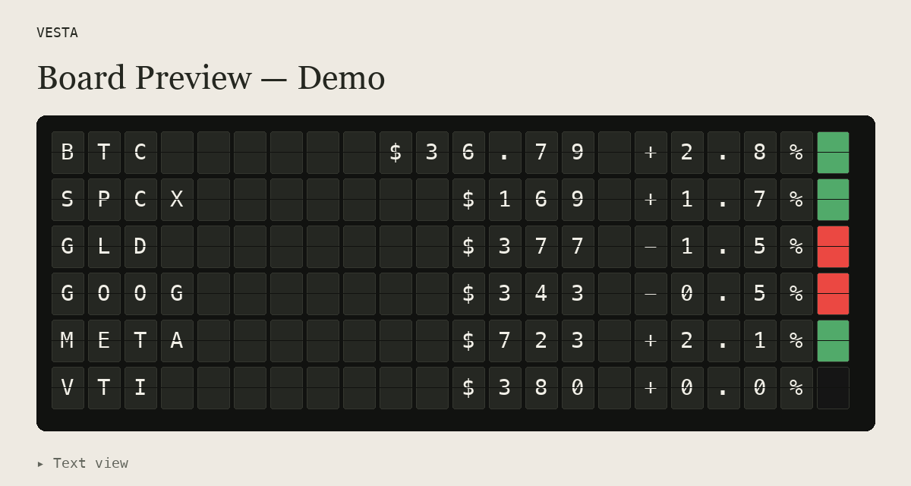

# Vesta

Display equity and crypto daily closing prices on your Vestaboard, with a color
square on the right: green for positive changes, red for negative changes, and
black when the displayed change rounds to `0.0%`.

## Install

Install with [uv](https://docs.astral.sh/uv/guides/tools/) and Python 3.10 or newer:

```bash
uv tool install git+https://github.com/akan72/vesta
vesta --help
```

Use `vesta -h` or `vesta --help` for options, environment variables, and concrete
examples of sending, selecting symbols, and saving previews.

For a local checkout, an editable installation follows source changes after a
`git pull`:

```bash
uv tool install --editable .
```

For an existing non-editable local installation, refresh it after pulling:

```bash
uv tool install --reinstall .
```

## Preview

Preview in the terminal or open a local HTML rendering. Neither requires board
credentials or sends anything to Vestaboard:

```bash
vesta --dry-run
vesta --dry-run --symbols AAPL,MSFT,NVDA
vesta --preview
```

For a headless session, save the HTML without opening a browser:

```bash
vesta --symbols GLD,GOOG --preview-file /tmp/vesta-preview.html
```

If Yahoo Finance rate-limits a preview, Vesta automatically uses fixed BTC, SPCX,
GLD, GOOG, META, and VTI sample values. Both the terminal and HTML label them as
demo data. Other fetch failures produce an error instead of sample data.

To preview the sample layout offline:

```bash
vesta --demo
vesta --demo --preview
vesta --demo --preview-file "./board preview.html"
```

Demo mode always previews, and uses its fixed sample symbols regardless of
`--symbols`. It never sends sample prices to the board.
The six rows show three green squares (BTC, SPCX, META), two red squares (GLD,
GOOG), and one black square (VTI).



## Send

Vesta sends through the Vestaboard Python SDK using your Read/Write API key:

```bash
export VESTABOARD_RW_KEY="your-read-write-api-key"
vesta
vesta --symbols AAPL,MSFT,NVDA
```

You can also supply the key with `--api-key`. A normal send fetches fresh prices;
if Yahoo rate-limits or any quote is unavailable, Vesta exits nonzero without
updating the board.

## Symbols and prices

Supply one to six unique Yahoo Finance symbols with `--symbols` / `-s` or
`VESTA_SYMBOLS`. Defaults: `BTC-USD,GLD,GOOG`. Use USD-denominated instruments;
prices have a dollar sign and Vesta does not convert currencies.

Quotes are the latest available adjusted daily closes and changes from the
preceding closes, not streaming prices. Five days of history allow for
non-trading days. Missing quotes are never displayed as fabricated zero prices.

Ticker names are limited to six characters; crypto's `-USD` suffix is removed.
The rightmost board cell contains the color square. Terminal previews add a space
before the square for readability. If the price or percentage cannot fit, the
command reports an error without updating the board.

## License

MIT
